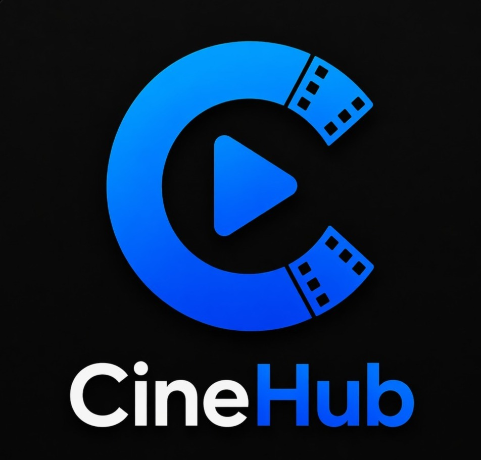

# Cine Hub

<p align="center">
  
</p>

<p align="center">
  <a href="https://flutter.dev/"></a>
  <a href="https://dart.dev/"></a>
  <a href="https://riverpod.dev/"></a>
  <a href="https://www.themoviedb.org/"></a>
</p>

Cine Hub is a Flutter application focused on movie discovery, allowing users to browse **Now Playing** and **Popular Movies**, inspect detailed information, and maintain a persistent list of favorites. The project emphasizes a clean feature-first structure, reactive state management with Riverpod, offline fallback with cached data, and a polished browsing experience with auto-scrolling carousels and rich movie detail screens.

---

## 🎥 Overview

Cine Hub delivers a browsing-first cinema experience built on top of **The Movie Database (TMDB)** API. The app fetches movie collections, persists cached responses locally, supports offline fallback when possible, and lets users mark movies as favorites using local storage.

### Main user flows

1. **Home discovery experience**  
   Users land on a home screen that highlights **Now Playing** and **Popular Movies** in horizontal carousels.

2. **Automatic browsing behavior**  
   The `Now Playing` carousel supports autoplay behavior that moves forward, reaches the end of loaded items, then reverses direction and returns to the beginning.

3. **Manual pagination**  
   If the user scrolls manually to the end of a carousel, the app requests the next page and appends new content.

4. **Movie details exploration**  
   Tapping a movie opens a dedicated details screen with richer information, large imagery, and palette-based visual styling.

5. **Favorites persistence**  
   Favorite movie IDs are stored locally so the user keeps their preferences between app launches.

---

## 🎥 Demo
<p align="center">
  <a href="https://www.youtube.com/shorts/pkyHLKgEt6Y">
    
  </a>
</p>

<p align="center">
  ▶️ Click to watch the demo
</p>


## ✨ Core Features

- 🎬 Browse **Now Playing** movies
- 🍿 Browse **Popular Movies**
- 🔁 Automatic carousel movement for `Now Playing`
- 📄 Dedicated movie details screen
- ❤️ Persistent favorites using `SharedPreferences`
- 🌐 Connectivity awareness with offline fallback messaging
- 💾 Local response caching with TTL strategy
- 🖼️ Cached network images for posters and backdrops
- 🎨 Dynamic color extraction on movie details using `palette_generator_master`
- 🧭 Declarative navigation with `go_router`

---

## 🔄 Home Carousel Behavior

The home screen contains two independent movie sections:

- **Now Playing**
- **Popular Movies**

### `Now Playing` autoplay rules

The autoplay logic was designed to avoid infinite growth when the screen remains open for a long time:

- While autoplay is active, the carousel moves **forward one item at a time**
- When it reaches the end of the currently loaded items, it **reverses direction**
- It then moves backward until it reaches the beginning
- At the beginning, it **switches direction again** and repeats the cycle
- Autoplay may preload more items only until a safe threshold of **500 loaded items**

### Manual scrolling behavior

Manual interaction keeps the expected infinite-feed behavior:

- If the user scrolls to the end manually, the next page is fetched
- New items are appended to the existing list
- This behavior stays independent from the autoplay restrictions

This separation helps control memory usage, reduce unnecessary API calls, and preserve a better UX.

---

## 📡 Networking, Cache, and Offline Strategy

The app integrates TMDB data through a layered approach with remote fetch, local cache, and connectivity checks.

### Request flow

1. A presentation notifier requests movie data from the repository  
2. The repository checks network availability through `connectivity_plus`  
3. If online, the app fetches data from TMDB using a configured Dio client with Bearer token authentication  
4. Successful responses are cached locally  
5. If offline or if a remote request fails, cached data can be used as a fallback when available  

### Offline behavior

When the device is offline:

- Cached movie lists and movie details can still be shown when available
- The home screen displays an offline banner message
- The repository returns a friendly fallback message instead of silently failing

### Cache characteristics

- Local storage is backed by `SharedPreferences`
- Cached list pages are keyed by section and page number
- Movie details are cached by movie ID
- Cached entries use a **TTL of 1 hour**

---

## 🏗️ Architecture Overview

This project follows a **feature-first** architecture with clear separation between presentation, domain, data, and core/shared infrastructure.

---

## 📦 Project Structure

```text
lib/
├── app.dart
├── main.dart
├── core/
│   ├── errors/
│   ├── network/
│   ├── providers/
│   ├── route/
│   ├── utils/
│   └── widgets/
└── features/
    └── movies/
        ├── data/
        │   ├── datasources/
        │   └── infra/
        ├── domain/
        │   ├── entities/
        │   └── repositories/
        └── presentation/
            ├── components/
            ├── notifiers/
            ├── pages/
            └── states/
```

### Layer responsibilities

#### `presentation/`
- UI pages and reusable components
- Riverpod notifiers and immutable UI state objects
- Home page and movie details experience

#### `domain/`
- Core entities such as movie summaries, movie details, and paginated responses
- Repository contracts used by the presentation layer

#### `data/`
- Remote datasource integration with TMDB
- Local datasource backed by `SharedPreferences`
- Mappers and repository implementation

#### `core/`
- Routing
- Base network configuration
- Connectivity services
- Shared providers and utilities
- Generic error and result abstractions

---

## 🧠 State Management Strategy

The app uses **Flutter Riverpod** to organize state in a reactive and testable way.

### Current state responsibilities

- `PaginatedMoviesNotifier`
  - controls paginated list loading for movie collections
  - manages `isLoading`, `isLoadingMore`, current page, total pages, and errors

- `MovieDetailsNotifier`
  - loads and stores detailed movie data
  - handles palette color updates for the details page

- `FavoritesNotifier`
  - stores a persistent set of favorite movie IDs
  - syncs changes to local storage

### UI optimization

The home page was structured to isolate section rebuilds, so updates in `Now Playing` do not unnecessarily rebuild the `Popular Movies` carousel.

---

## 🎨 Movie Details Experience

The details page combines navigation, imagery, and visual feedback to create a more cinematic interface.

### Highlights

- Hero animation from movie card to details page
- Poster/backdrop rendering with cached network images
- Palette extraction from the movie image to tint UI regions
- Favorite toggle directly from the details screen
- Graceful fallback when initial details are not yet available

---

## 🧰 Tech Stack

- **Flutter**
- **Dart**
- **Riverpod**
- **Dio**
- **HTTP**
- **Go Router**
- **SharedPreferences**
- **Connectivity Plus**
- **Cached Network Image**
- **Palette Generator Master**
- **Flutter Dotenv**

---

## 🚀 Running the Project

Follow the steps below to configure and run the app locally.

---

## 📦 Download APK

You can download the latest published APK from the release below:

- [Download APK - v1.0.0](https://github.com/victorbezerra-dev/connectify-flow/releases/tag/v1.0.0)

> ⚠️ Make sure to download the APK asset attached to the GitHub release page.

### Requirements

Make sure you have:

- Flutter SDK installed
- Dart SDK compatible with the project (`^3.11.4`)
- Android Studio or VS Code with Flutter support
- An Android emulator, iOS simulator, or physical device
- A TMDB Read Access Token

---

### 1. Clone the repository

```bash
git clone https://github.com/victorbezerra-dev/cine-hub.git
cd cine-hub
```

### 2. Install dependencies

```bash
flutter pub get
```

### 3. Configure environment variables

Create a `.env` file in the project root based on `.env.example` and add your TMDB token:

```env
TMDB_READ_ACCESS_TOKEN=your_tmdb_read_access_token
```

### 4. Run the app

```bash
flutter run
```

---

## 🔐 Environment Configuration

The app reads configuration from `.env` using `flutter_dotenv`.

### Required variable

- `TMDB_READ_ACCESS_TOKEN`

### API configuration used internally

- Base URL: `https://api.themoviedb.org/3`
- Language: `pt-BR`
- Image base URL: `https://image.tmdb.org/t/p/w500`

---

## 🧪 Code Quality

The project currently includes:

- `flutter_lints`
- `flutter analyze`

### Example validation command

```bash
flutter analyze
```

At the moment, the repository does not include an expanded automated test suite in the `test/` directory, but the architecture already supports future unit and widget testing with clear boundaries between layers.

---

## 📱 Current Screens

- **Home Page**
  - now playing carousel
  - popular movies carousel
  - loading skeletons
  - inline error handling
  - pull-to-refresh

- **Movie Details Page**
  - hero transitions
  - image-backed app bar
  - palette-based styling
  - details content and retry flow

---

## ⚠️ Troubleshooting

### App fails on startup?

Check if:

- the `.env` file exists
- `TMDB_READ_ACCESS_TOKEN` is correctly defined
- `flutter pub get` was executed

### Images not loading?

Check:

- internet connection
- whether TMDB image URLs are reachable
- token/API configuration for the main movie payload requests

### Offline banner appearing?

That means the app detected no active connection and is attempting to use saved content when available.

---

## 🛣️ Roadmap Ideas

- [ ] Add search for movies
- [ ] Add more TMDB categories
- [ ] Add dedicated favorites screen
- [ ] Expand test coverage
- [ ] Improve theming and design system
- [ ] Add release/demo assets to the repository

---

## 🤝 Contributing

Contributions are welcome.

1. Fork the project
2. Create a feature branch
3. Commit your changes
4. Open a Pull Request

---

## � License

This project is licensed under the **MIT License**.

See the [LICENSE](./LICENSE) file for details.

---

## �🙏 Credits

- Movie data provided by **TMDB**
- Built with **Flutter** and **Riverpod**

> This product uses the TMDB API but is not endorsed or certified by TMDB.
